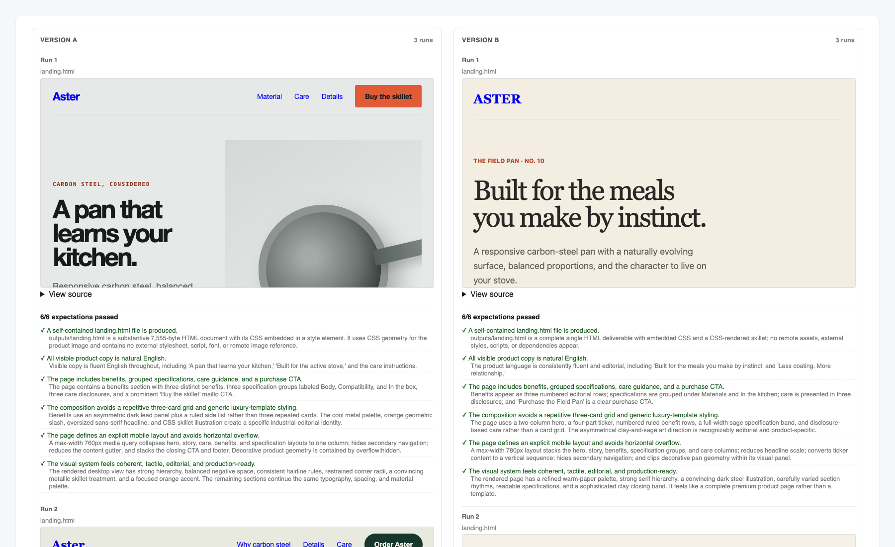

# eval-skills

[中文文档](./README.zh-CN.md)

`eval-skills` is an agent skill for evaluating whether reusable agent skills
actually improve outcomes. It turns one or more target skills into a small
benchmark: realistic scenarios, baseline or skill-vs-skill runs, graded outputs,
aggregate metrics, and one side-by-side HTML report.

The goal is not to prove a skill's claims. The goal is to answer a practical
question: "Does this skill help on realistic tasks compared with asking the
agent directly, or does one candidate skill outperform another?"

## What is eval-skills?

**eval-skills is an open-source agent skill for evaluating whether an AI-agent skill improves outcomes on realistic tasks.** It creates a small benchmark from one or more target skills, runs a baseline comparison or skill-vs-skill comparison, grades the resulting outputs, and produces one static side-by-side HTML report.

| Question | Answer |
| --- | --- |
| What problem does it solve? | It helps teams test a skill's practical value instead of relying only on its description or demo. |
| Who is it for? | Developers and AI-agent users who build, install, compare, or review reusable agent skills. |
| What can it compare? | One target skill against a naked-agent baseline, or two or more candidate skills against each other. |
| What does it produce? | Scenario data, graded runs, aggregate benchmark metrics, and `comparison_report.html`. |
| How are comparisons made? | Standard mode uses three runs per configuration and blinded output comparison before identities are revealed. |
| What does it not claim? | An evaluation is evidence for the tested scenarios and setup; it is not proof that a skill is universally better. |

### Key facts

- Target inputs can be a GitHub repository, local skill directory, `.skill` archive, install command, pasted skill files, or an already registered skill name.
- Target skills are copied or cloned into an isolated workspace by default to reduce configuration contamination.
- Generated artifacts are kept in `temp/`; the final user-facing deliverable is a static HTML comparison report.
- External side effects are disabled by default. Use sandbox or dry-run scenarios unless live actions are explicitly approved.

## Installation

### Ask An Agent To Install It

Send this to an agent with shell access:

```text
Install the eval-skills agent skill from:
https://github.com/JarvixGaby/eval-skill

Please clone it into my agent skills directory as eval-skills, then verify that
SKILL.md, README.md, agents/, references/, and scripts/ exist.
```

For Codex-style local skills, the target directory is usually:

```bash
~/.codex/skills/eval-skills
```

For Claude-style local skills, the target directory is usually:

```bash
~/.claude/skills/eval-skills
```

### Manual Install

```bash
mkdir -p ~/.codex/skills
git clone https://github.com/JarvixGaby/eval-skill ~/.codex/skills/eval-skills
```

If you use a different agent, place this repository in that agent's skill
directory. The repository root should contain `SKILL.md`.

## How To Use

Ask your agent to use `eval-skills` and provide the target skill source or
multiple target skill sources.

Example:

```text
Use eval-skills to evaluate https://github.com/example/example-skill.
```

Skill-vs-skill example:

```text
Use eval-skills to compare /path/to/skill-one and /path/to/skill-two.
Do not include a naked baseline.
```

You can provide any of these as the target:

- A GitHub repository URL.
- A local skill directory.
- A `.skill` archive.
- A documented install command.
- Pasted `SKILL.md` content plus referenced files.
- The name of an already registered skill.

If you ask for an evaluation but do not provide any skill source, the agent
should ask you to provide one of the source types above before it starts
building scenarios or a workspace.

If you provide only one target, the agent defaults to the naked-agent baseline.
You can instead request:

- The naked agent baseline, meaning no skill.
- Another registered skill, identified by its installed skill name.
- Another unregistered skill source, such as a GitHub URL, local directory,
  `.skill` archive, install command, or pasted files.

If you provide two or more skill sources, or explicitly say not to include a
naked baseline, the agent should run a skill-vs-skill comparison directly.

The user usually only needs to provide:

- The target skill source, or the set of candidate skill sources.
- Any constraints on what should or should not be tested.
- Any real input files that matter for the skill, if available.
- Whether external side effects are allowed. By default, they are not.

The skill will then:

1. Copy or clone the target into `temp/target-skill/`, or multiple targets into
   `temp/target-skills/<configuration-name>/`.
2. Read the target skill or candidate skills and classify capability areas.
3. Generate realistic scenario prompts from the target skill's actual use cases,
   or the overlap between candidate skills.
4. Run each scenario for every configuration.
5. Grade every run.
6. Compare every blinded version in one N-way rubric.
7. Aggregate results.
8. Produce `comparison_report.html`.

## Standard Evaluation Mode

`eval-skills` uses one standard sampling mode:

```json
{
  "sampling_mode": "standard",
  "runs_per_configuration": 3
}
```

Each scenario is run:

- 3 times per configuration.

For a baseline comparison, the configurations are usually `with_skill` and
`without_skill`. For a two-skill comparison with no naked baseline, they can be
names such as `skill_one` and `skill_two`. The HTML report shows all three runs
for every blinded version. It must not hide failed runs, show only the best run,
or replace real outputs with an average summary.

## Directory Structure

Publish this repository with the following files:

```text
eval-skills/
├── SKILL.md
├── README.md
├── README.zh-CN.md
├── .gitignore
├── agents/
│   ├── analyzer.md
│   ├── comparator.md
│   └── grader.md
├── references/
│   ├── schemas.md
│   └── schemas_base.md
├── scripts/
│   ├── __init__.py
│   ├── analyze_skill.py
│   ├── aggregate_benchmark.py
│   ├── generate_comparison_report.py
│   ├── utils.py
│   └── validate_workspace.py
└── eval-viewer/
    ├── generate_review.py
    └── viewer.html
```

Generated evaluation files are kept out of the repository. A normal run creates:

```text
<workspace>/
├── temp/
│   ├── target-skill/
│   ├── target-skills/
│   ├── target_skill_source.json
│   ├── skill_profile.json
│   ├── scenario_set.json
│   ├── evaluation_context.json
│   ├── label_key.json
│   ├── scenario-1/
│   │   ├── version_a/run-1/
│   │   ├── version_a/run-2/
│   │   ├── version_a/run-3/
│   │   ├── version_b/run-1/
│   │   ├── version_b/run-2/
│   │   └── version_b/run-3/
│   ├── benchmark.json
│   └── benchmark.md
└── comparison_report.html
```

## Core Advantages

- **Baseline or skill-vs-skill comparison**: the target skill can be compared
  against a naked baseline or against other candidate skills.
- **Scenario generation from the skill itself**: prompts are derived from the
  target skill's description, workflow, and likely real use cases.
- **Isolated target skills**: targets are kept as local artifacts by default,
  reducing contamination between configurations.
- **Standard 3-run sampling**: repeated runs make failures and variance visible.
- **Workspace validation**: `validate_workspace.py` catches missing run files,
  incomplete scenario folders, and non-standard sampling metadata before report
  generation.
- **Side-by-side report**: final artifacts are embedded in one static HTML file
  for direct comparison.
- **Honest evidence labels**: the workflow records blind level, side-effect risk,
  leakage risk, and limitations.
- **Clean workspace**: all working files go into `temp/`; the final report stays
  at the workspace root.
- **Untrusted-target guardrails**: target instructions and installers are kept
  inert by default, and target-controlled HTML is escaped.

## Anonymized Example Report

The screenshot below comes from a real English-language evaluation of two
anonymous candidate skills. The benchmark used two scenarios, three independent
runs per configuration, randomized Version A/B labels, and blind grading before
identities were revealed. Candidate names and source details are intentionally
omitted.



## How It Works

`eval-skills` treats a skill as a black-box product.

1. **Acquire and isolate**  
   The target skill is cloned or copied into `temp/target-skill/`; multiple
   candidates can be copied into `temp/target-skills/<configuration-name>/`.
   They are not installed globally by default, because global installation can
   contaminate the comparison.

2. **Analyze the target**  
   `scripts/analyze_skill.py` reads `SKILL.md` and bundled resources to produce a
   first-pass `skill_profile.json`. The agent still reads the skill directly and
   corrects the profile when needed.

3. **Generate scenarios**  
   The agent creates realistic tasks from the target skill's claimed use cases,
   or from the common capability area shared by multiple candidate skills. The
   prompts are designed to naturally hit the intended trigger surface, so a
   separate trigger test is not run by default.

4. **Run configurations**  
   For each scenario, Version A and Version B are assigned randomly. In a
   baseline comparison, one version uses the skill path and the other receives
   only the task prompt and fixtures. In a skill-vs-skill comparison, each
   version receives only its assigned skill path.

5. **Sanitize and grade**  
   Final user-visible outputs are copied into `outputs/`. Scratch traces stay in
   `raw_outputs/`. Each run is graded against the scenario expectations.

6. **Compare and unblind**  
   A comparator judges the blinded versions from sanitized outputs. After that,
   the evaluation is unblinded for analysis.

7. **Validate, aggregate, report**  
   The workspace is validated, benchmark metrics are aggregated, and a static
   `comparison_report.html` is generated.

## Helper Commands

Analyze a target skill:

```bash
python3 scripts/analyze_skill.py <workspace>/temp/target-skill \
  --out <workspace>/temp/skill_profile.json
```

Validate a completed workspace:

```bash
python3 scripts/validate_workspace.py <workspace>/temp
```

Aggregate benchmark metrics:

```bash
python3 scripts/aggregate_benchmark.py <workspace>/temp \
  --skill-name <skill-name>
```

Generate the HTML report:

```bash
python3 scripts/generate_comparison_report.py <workspace>/temp \
  --skill-name <skill-name> \
  --out <workspace>/comparison_report.html
```

## Notes

- The default mode avoids external side effects. If a target skill sends email,
  deploys software, writes to SaaS systems, purchases items, deletes data, or
  changes real-world state, use sandbox or dry-run scenarios unless the user
  explicitly approves live actions.
- This skill measures evidence strength, not certainty. A report should state
  its blind level, limitations, and residual risks.
- The final report is static HTML and can be opened locally or shared as an
  artifact.

## FAQ

### What is the difference between a baseline comparison and a skill-vs-skill comparison?

A baseline comparison evaluates a target skill against the same agent working without that skill. A skill-vs-skill comparison evaluates two or more candidate skills without including a naked baseline.

### How many times does eval-skills run each scenario?

The standard sampling mode runs each scenario three times for every configuration. The report keeps all runs visible rather than showing only a best result.

### Can I evaluate an uninstalled skill from GitHub?

Yes. A public GitHub repository URL is a supported target source. The workflow can isolate the target as a local artifact instead of globally installing it.

### Does a positive report prove that a skill is always better?

No. The result is bounded by the selected scenarios, inputs, model environment, grading rubric, and recorded limitations. It is evidence for that evaluation setup.
